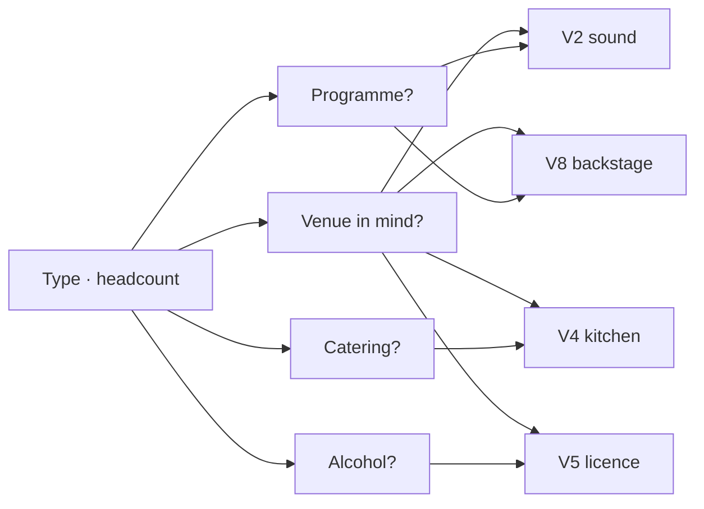

*Reference document. `src/rules.json` is the rule table of record; this file is the reference it was built from and explains it. The tool was built by a venue for its own use and published venue-neutral: where the text says the venue handles something, it means whichever venue the visitor has in mind.*

# Sääntötaulukko v2 — yhdeksän ajoa

2026-09-21

One rule table, two runs through it. If the same rows produce a sensible plan for an 80-guest wedding and a 300-person club night, the universality claim holds.

## How to read the table

Every row is one rule: **trigger → task**. A run through the deck fires every row whose trigger is true; the fired rows, sorted by deadline, are the plan. Rows are set union — order of firing never matters.

| Column | Meaning |
| --- | --- |
| ID | Stable key. Base rows `C-` (closed) and `P-` (public); circuit rows `X-`; service rows `S-` (fired by the type's service profile); type exceptions `H-` (Häät), `K-` (Klubi), `SE-`, `KE-`, `MU-`, `F-`; venue capability rows `V-` |
| Trigger | `always` for base rows, otherwise an answer: `programme = live \| DJ \| speakers \| own production \| none`, `tickets = yes`, `venue.pa = no`, `headcount ≥ 200`, `profile suggests Ääniteknikko` |
| Task | What the visitor sees. English in v1; Finnish copy comes with the wording pass |
| Cat | One of the eight |
| Owner | `mine` (default), `venue` (if swiped up: the venue handles it), `prepare/sign` (the venue can prepare, organiser must sign) |
| Deadline | A phase (proportional) or a fixed offset from E (statutory or contractual). Never both |
| State | `fired`, `not fired`, or `pending` — the trigger references a venue answer not yet given (no venue in mind). Pending rows show greyed and resolve on re-entry |

**Suppression rule.** A capability the venue *has* beats a profile suggestion: `venue.staff = has tech` suppresses Ääniteknikko's rows, `venue.seating = has it` suppresses Extra kalusto's furniture rows, `tickets = no` suppresses Lipunmyynti's. The profile is a recommendation; the venue answer is a fact.

**Base deck** is picked by the cover screen's public/private toggle, not by the family. The family sets the toggle's default and adds its exceptions. Open registration is a public event.

**Headcount** on the cover screen means *people at once, at the busiest point* — that's what the 200-person rescue-plan threshold counts.

**Several performances.** When performances > 1, E is opening night and a second date card gives the last performance; P5 counts from that, and per-performance rows repeat per date.

**Alcohol** is answered as *none / we bring it / we sell it / the venue handles it*. The licence and bar rows key on *we*; only the age-limit row keys on any *sold*.

**E** is the event date. **R** is the runway, days from today to E.

| Phase | When | Meaning |
| --- | --- | --- |
| P1 | Now | Start immediately — things everything else waits on |
| P2 | E − R/2 | Midway |
| P3 | E − 21 d, or midway if R < 42 d | Confirmations, briefings, final numbers |
| P4 | Event week | On-site, handover, schedules |
| P5 | E + 7 d | After: thanks, invoices, reports, returns |
| E − n d | Fixed | Statutory or contractual; never scales with R. If R < n the task is shown red, not moved |

When R < 42 d the plan view collapses P1–P3 into *now* and shows two phases, *now* and *event week*, instead of three deadlines a day apart.

## The two runs

Both have a venue in mind, so the venue circuit gets exercised. Both have a programme, so Programming feeds Catering and Logistics in both. They differ on everything the two base decks are supposed to differ on.

|  | A — Häät | B — Klubi |
| --- | --- | --- |
| Type | Yksityistilaisuus → Häät | Musiikkitapahtuma → Klubi |
| Base deck | Closed occasion | Public cultural |
| Service profile | Seated, catering guaranteed | Standing, stage, no seating |
| Public / private | Private (inferred) | Public (inferred) |
| Headcount | 51–100 (80) | 201–500 (300) |
| Runway R | 240 d | 60 d |
| Venue in mind | Yes — a rented hall | Yes — a bar's back room |
| Programme | Yes — a small band, DJ after | Yes — two DJs, one live act |
| Alcohol | Offered free to guests | Sold |
| Tickets / registrations | No — invitations and RSVPs | Yes — tickets, advance and door |
| Catering | Yes (guaranteed by type) | No food; hospitality rider only |
| Staffing | Friends and family | Paid crew: door, sound, stewards |

Scope-pass answers derived from the above: A says *part of it* to all eight except Security (which it can't turn off; it's small). B says *part of it* to all eight; Catering exists only because the rider drags it in.

## The ten venue capability questions

Asked only when there's a venue in mind. Left = doesn't have it, right = has it, up = no idea. Every *up* fires one row: **V-0 — confirm with the venue: ‹thing›** (Venue, mine, P1). Every *left* fires the rows listed. A *right* fires nothing. Questions 8–10 are skipped when the type's service profile or scope answers make them moot.

| # | Question | Asked when | "No" fires |
| --- | --- | --- | --- |
| V0 | Is it a bare space — you bring everything? | always | *Yes* pre-answers V2, V2b, V3, V4, V5, V8, V10, V11 as no (fail-open: tasks they can swipe away). V1, V6, V7, V9 still asked |
| V1 | Capacity for your headcount? | always | Find a bigger venue or cut the list (Venue, P1) |
| V2 | Sound: PA and mics? | programme ≠ none | X-10 rent PA · X-11 book a sound engineer · X-12 delivery and return · X-13 power check |
| V2b | Projector, screen, stream? | programme = speakers, or presentation = yes | X-15 rent projector and screen · X-16 someone to run AV · X-12 delivery and return · X-13 power check |
| V3 | Stage and stage lighting? | layout has stage | X-14 rent stage and lights · X-13 power check |
| V4 | Kitchen or serving space? | catering = yes | X-20 catering delivered or off-site · X-21 serving and warming plan |
| V5 | Alcohol licence? | alcohol = we bring OR we sell | We bring: X-30 confirm own drinks allowed. We sell: X-31 arrange anniskelu |
| V6 | Seating and tables for your headcount? | layout = seated, or catering = seated meal, or exhibitors = yes | X-40 rent chairs and tables · X-41 delivery and return |
| V7 | Accessible entrance and toilet? | always | X-50 tell guests about access limits · X-51 assistance on the day |
| V8 | Backstage or dressing room? | programme = live | X-60 improvise a green room |
| V9 | Load-in access and parking? | programme ≠ none, or catering = yes, or exhibitors = yes | X-70 load-in plan with carry distance and times |
| V10 | Venue host on the day (someone of theirs on site)? | always | X-80 your own on-site host · X-82 stewards are yours to find (public) |
| V11 | Venue tech on the day? | programme ≠ none | X-81 tech on the day · X-16 AV operator · lifts the suppression on Ääniteknikko / Valoteknikko rows |

Run A asks 9 of the 10 (V3 skipped: a seated wedding has no stage in its profile; the band plays on the floor). Run B asks 9 (V4 skipped: no catering). Both are inside the "not twenty" budget, and the skips come from the type and scope answers, not from special-casing.

A's *up* on V7 and B's *up* on V1 each produce one **confirm with the venue** task at P1. That's the deliberate shape: *no idea* costs nothing now and puts one phone call at the top of the plan.

## Base deck: closed occasion

Fires when the cover-screen toggle is *private* — by default Häät, Yksityistilaisuus, Seminaari and Yritystapahtuma. 24 always-on rows plus 5 service rows fired by the profile. Communications here is *guest* communication; there is no public marketing in this deck at all — that's the fix for "Markkinointi ja viestintä".

| ID | Trigger | Task | Cat | Owner | Deadline |
| --- | --- | --- | --- | --- | --- |
| C-01 | always | Set the budget and who pays what | Financing | mine | P1 |
| C-02 | always | Pay the venue deposit | Financing | mine | P1 |
| C-03 | always | Check every invoice against what was agreed | Financing | mine | P5 |
| C-10 | always | Go and see the venue | Venue | mine | P1 |
| C-11 | always | Confirm the date and book it | Venue | mine | P1 |
| C-12 | always | Sign the venue contract; read the cancellation terms | Venue | mine | P1 |
| C-13 | always | Check what the venue's insurance covers and what's on you | Venue | mine | P2 |
| C-14 | always | Agree access times, keys, alarm, load-in | Venue | mine | P3 |
| C-15 | always | Walk-through and handover with the venue | Venue | mine | P4 |
| C-16 | always | Return keys, final inspection, deposit back | Venue | mine | P5 |
| C-20 | always | Build the guest list | Communications | mine | P1 |
| C-21 | type ≠ Seminaari | Send invitations (save-the-date first if R > 180 d) | Communications | mine | P2 |
| C-22 | type ≠ Seminaari | Set and chase the RSVP deadline | Communications | mine | P3 |
| C-23 | always | Send practical info: address, timetable, parking, dress | Communications | mine | P3 |
| C-24 | always | Thank your guests and helpers | Communications | mine | P5 |
| C-30 | always | Write the running order for the day | Programming | mine | P2 |
| C-31 | always | Decide who hosts / MCs | Programming | mine | P2 |
| C-40 | always | Furniture and room layout plan | Logistics | mine | P3 |
| C-41 | always | Decorations: what, who brings, when it goes up | Logistics | mine | P3 |
| C-42 | always | Teardown and who takes what home | Logistics | mine | P5 |
| C-50 | always | Who does what on the day — one list, names next to jobs | Staffing | mine | P3 |
| C-60 | always | Name one responsible adult on site who isn't the host | Security | mine | P3 |
| C-61 | always | Know the exits, the first-aid kit and the nearest päivystys | Security | mine | P4 |
| C-62 | always | Who's driving home — and how the rest get home | Security | mine | P3 |
| S-01 | profile suggests Valoteknikko AND venue.tech = no | Book a lighting tech, or agree the venue's does it | Staffing | mine | P2 |
| S-03 | profile suggests Häirintäyhdyshenkilö | Name a harassment contact person; say who and how to reach them in the guest info | Security | mine | P3 |
| S-04 | profile suggests Extra kalusto AND NOT venue.seating has it | Extra equipment list: what, from where, who returns it | Logistics | mine | P2 |
| S-05 | profile suggests Järjestyksenvalvonta | Door host or stewards for the evening — who, and are cards needed | Security | mine | P3 |
| S-06 | profile suggests Catering | Fires X-22…X-25 without a scope question | Catering | — | — |
| S-07 | always | Cleaning after the event: who, by when, what the venue expects back | Logistics | mine | P5 |

No Catering rows in the base: catering is either guaranteed by type (Häät) or a scope answer, and both fire the same circuit rows (X-20…). Seminaari swaps C-21/C-22 for registration rows in its exception list.

## Base deck: public cultural

Fires when the toggle is *public* — by default Keikka, Klubi, Teatteri, Stand-up and Muu kulttuuritapahtuma, and any closed type flipped to public (open-registration seminar). 30 rows, of which the programme rows need a programme and the ticket rows need tickets: a free fair with no stage gets 19. Plus 4 service rows. The Venue rows are the same seven as the closed deck (C-10…C-16) and are stored once.

| ID | Trigger | Task | Cat | Owner | Deadline |
| --- | --- | --- | --- | --- | --- |
| P-01 | always | Set the budget: fees, venue, tech, crew, promo — and the break-even count | Financing | mine | P1 |
| P-02 | always | Pay the venue deposit | Financing | mine | P1 |
| P-03 | tickets = yes | Decide ticket price and sales platform | Financing | mine | P2 |
| P-04 | programme ≠ none | Teosto event licence (Gramex for recorded music) — apply by E − 14 d | Financing | mine | P2 |
| P-05 | tickets = yes | Cash and card at the door: float, reader, who counts | Financing | mine | P4 |
| P-06 | programme ≠ none | Settle performer or speaker fees; Teosto setlist report by E + 14 d | Financing | mine | P5 |
| P-07 | tickets = yes | Reconcile ticket sales, door and bar against the budget | Financing | mine | P5 |
| P-10 | programme ≠ none | Book performers or speakers; agree fee, length, tech needs | Programming | mine | P1 |
| P-11 | programme ≠ none | Contracts or written confirmations | Programming | mine | P2 |
| P-12 | programme = live OR DJ | Collect technical riders | Programming | mine | P2 |
| P-13 | programme ≠ none | Running order and stage times | Programming | mine | P3 |
| P-14 | programme = live OR DJ | Soundcheck schedule | Programming | mine | P4 |
| P-20 | always | Announce the event: title, date, venue, price or free, age limit | Communications | mine | P2 |
| P-21 | tickets = yes | Open ticket sales and say so | Communications | mine | P2 |
| P-22 | always | Promo push: socials, posters, lists, press if any | Communications | mine | P3 |
| P-23 | always | Door info published: times, age limit, accessibility, what's not allowed | Communications | mine | P3 |
| P-24 | always | Post-event thanks and recap | Communications | mine | P5 |
| P-30 | always | Ilmoitus yleisötilaisuudesta to the police ("probably needed" for 51–200, "needed" above) | Security | prepare/sign | E − 5 d |
| P-31 | always | Decide the age limit and how it's checked | Security | mine | P3 |
| P-32 | always | Stewards (järjestyksenvalvojat): how many, who, cards valid | Security | mine | P3 |
| P-33 | always | First aid: kit, who's trained, where | Security | mine | P3 |
| P-34 | always | Safety briefing for crew: exits, capacity, incidents | Security | mine | P4 |
| P-40 | tickets = yes | Door and box office staff | Staffing | mine | P3 |
| P-41 | always | Person who runs the day — stage manager or floor manager | Staffing | mine | P3 |
| P-42 | always | Crew schedule with call times | Staffing | mine | P4 |
| P-50 | always | Load-in / load-out plan with times and who carries | Logistics | mine | P4 |
| P-51 | programme = live OR DJ | Backline and equipment list — what comes from where | Logistics | mine | P3 |
| P-52 | tickets = yes | Ticket scanning / guest list setup at the door | Logistics | mine | P4 |
| P-53 | always | Merch or info table if any | Logistics | mine | P4 |
| P-54 | always | Teardown, returns, lost property | Logistics | mine | P5 |
| S-01 | profile suggests Valoteknikko AND venue.tech = no | Book a lighting tech, or agree the venue's does it | Staffing | mine | P2 |
| S-02 | profile suggests Printit | Posters, programmes, signage: design, print, hang | Communications | mine | P3 |
| S-03 | profile suggests Häirintäyhdyshenkilö | Name a harassment contact person; say who and how to reach them in the door info | Security | mine | P3 |
| S-04 | profile suggests Extra kalusto AND NOT venue.seating has it | Extra equipment list: what, from where, who returns it | Logistics | mine | P2 |
| S-07 | always | Cleaning after the event: who, by when, what the venue expects back | Logistics | mine | P5 |

Catering has no base rows here either. A club night has Catering only because the hospitality rider drags it in (X-01).

## Circuit rows

These are the expertise. Each fires on an answer, in either deck. The *Cat* column is where the work lands, which is usually not where the question was asked — that's the point.

| ID | Trigger | Task | Cat | Owner | Deadline |
| --- | --- | --- | --- | --- | --- |
| X-01 | programme = live | Get the hospitality rider and answer it: food, drinks, towels, who buys | Catering | mine | P3 |
| X-02 | programme = live OR speakers | Transport and accommodation for performers or speakers, or confirm they're arranging their own | Logistics | mine | P2 |
| X-03 | programme = live OR speakers | Arrival time, parking, contact on the day | Logistics | mine | P4 |
| X-04 | programme = live OR DJ OR own production, deck = closed | Music licence: check whether the venue's Teosto cover applies to private events | Financing | mine | P2 |
| X-05 | programme = DJ | DJ tech: decks, mixer, who brings what | Logistics | mine | P3 |
| X-06 | programme = DJ only | No rider; ask DJs for drinks preference in one message | Catering | mine | P3 |
| X-10 | venue.pa = no | Rent a PA sized for the room and headcount | Logistics | mine | P2 |
| X-11 | venue.pa = no, OR profile suggests Ääniteknikko AND venue.tech = no | Book a sound engineer for soundcheck and show | Staffing | mine | P2 |
| X-12 | venue.pa = no OR venue.av = no | Equipment delivery, setup time, return | Logistics | mine | P4 / P5 |
| X-13 | venue.pa = no OR venue.av = no OR venue.stage = no | Power: enough circuits for the tech, where the board is | Venue | mine | P3 |
| X-14 | venue.stage = no AND layout has stage | Rent stage and lights | Logistics | mine | P2 |
| X-15 | venue.av = no | Rent projector and screen; test the laptop | Logistics | mine | P2 |
| X-16 | venue.av = no AND venue.tech = no | Someone to run AV and the stream on the day | Staffing | mine | P3 |
| X-20 | catering = yes AND venue.kitchen = no | Catering must be delivered ready or cooked off-site — tell the caterer | Catering | mine | P2 |
| X-21 | catering = yes AND venue.kitchen = no | Serving, warming and washing-up plan without a kitchen | Logistics | mine | P3 |
| X-22 | catering = yes | Book the caterer; agree menu and price per head. Copy when the venue caters: "agree the menu and price per head with the venue" | Catering | mine | P1 |
| X-23 | catering = yes | Collect dietary requirements and allergies | Communications | mine | P3 |
| X-24 | catering = yes | Final headcount and dietary list to the caterer | Catering | mine | E − 7 d (contractual) |
| X-25 | catering = yes AND staffing = friends | Serving and clearing: who, when — or ask the caterer to staff it | Staffing | mine | P3 |
| X-26 | staffing = paid crew | Crew catering: food and water for the crew, on the budget | Catering | mine | P3 |
| X-30 | alcohol = we bring AND venue.licence = no | Confirm the venue allows guests' own or host-provided drinks | Venue | mine | P1 |
| X-31 | alcohol = we sell AND venue.licence = no | Arrange anniskelu: licence holder serving in an approved space (3 d notice), or apply for a fixed-term anniskelulupa | Security | prepare/sign | P1 (application); E − 3 d (notice) |
| X-32 | alcohol = we sell | Bar staff and stock; who holds the till | Staffing | mine | P3 |
| X-33 | alcohol = we sell OR venue handles it | Age limit 18 and ID check at the door | Security | mine | P3 |
| X-34 | alcohol = none AND deck = public | All-ages: say so in the door info; no ID check row | Communications | mine | P3 |
| X-40 | venue.seating = no AND (layout = seated OR catering = seated meal OR exhibitors = yes) | Rent chairs and tables | Logistics | mine | P2 |
| X-41 | as X-40 | Furniture delivery and return | Logistics | mine | P4 / P5 |
| X-42 | layout = seated | Row plan and sightlines; reserved seats if any | Logistics | mine | P3 |
| X-50 | venue.access = no | Tell guests about access limits before they RSVP or buy | Communications | mine | P3 |
| X-51 | venue.access = no | Plan assistance on the day for guests who need it | Staffing | mine | P3 |
| X-60 | venue.backstage = no AND programme = live | Improvise a green room; say so in the rider reply | Logistics | mine | P3 |
| X-70 | venue.loadin = no | Load-in plan with carry distance and times | Logistics | mine | P4 |
| X-80 | venue.host = no | You need your own on-site host for the whole event | Staffing | mine | P3 |
| X-81 | venue.tech = no AND programme ≠ none | Tech on the day: who runs sound and lights | Staffing | mine | P3 |
| X-82 | venue.host = no AND deck = public | Stewards are yours to find, not the venue's | Security | mine | P3 |
| X-90 | headcount ≥ 200 AND deck = public | Pelastussuunnitelma to the pelastuslaitos | Security | prepare/sign | E − 14 d |
| X-91 | V0 bare space = yes AND ends late (after 22:00) | Meluilmoitus to the city | Security | prepare/sign | E − 30 d |
| X-92 | tickets = yes | Refund and cancellation terms decided before sales open | Financing | mine | P2 |
| X-93 | headcount ≥ 200 | Capacity count at the door: clicker and a number | Security | mine | P4 |
| X-94 | registration = paid | Invoice or collect payment; VAT treatment | Financing | mine | P2 |
| X-95 | programme = live AND (family = Musiikkitapahtuma OR Muu with a band) | Backline: what the bands bring, what's shared, who supplies the rest | Logistics | mine | P3 |
| X-96 | performances > 1 | Front of house per performance: door, ushers, interval — repeats per date | Staffing | mine | P4 |
| X-97 | merch = yes (public deck follow-up) | Merch: design, order quantities, lead time; P-53 covers the table on the day | Logistics | mine | P2 |
| X-98 | build/teardown days = yes — asked when layout has a stage, programme = own production, or exhibitors = yes | Book the venue for the days before and after; agree access and what may stay overnight | Venue | mine | P2 |
| X-99 | rigging = yes — asked when layout has a stage or lighting rig, or décor is hung | Rigging and truss: what hangs, who rigs it, load limits and the venue's rules — a rigging company, not the PA hire | Logistics | mine | P2 |

Rows with a `venue.*` trigger and no venue in mind are **pending**: shown greyed as *decided by your venue*, resolved on re-entry. `own production` never fires X-01…X-03: the performers are the organiser.

Rows with a `venue.*` trigger and no venue in mind are **pending**: shown greyed as *decided by your venue*, resolved on re-entry.

v1 folds the run-specific rows that turned out general into this table: KE-02 backline → X-95, KE-03 all-ages → X-34, KE-04 seated rows → X-42, K-03 DJ-only → X-06, SE-09 paid registration → X-94. The type-exception tables below keep their original IDs for the record.

## Type exceptions

A type adds rows only where it genuinely differs from its base. Häät has real ones — the ceremony is a legal act with its own clock. Klubi has almost none, which is the point: it's the public cultural base with a standing profile.

### Häät

| ID | Trigger | Task | Cat | Owner | Deadline |
| --- | --- | --- | --- | --- | --- |
| H-01 | always | Request avioliiton esteiden tutkinta from DVV (or your parish) — both of you, together | Programming | mine | E − 4 months at the earliest, request by E − 14 d |
| H-02 | always | Book the officiant and the ceremony venue if separate from the party | Programming | mine | P1 |
| H-03 | always | Two witnesses, named and told | Programming | mine | P2 |
| H-04 | always | Ceremony music, readings, vows — who does what | Programming | mine | P2 |
| H-05 | always | Catering is on: fires X-22…X-25 without asking | Catering | — | — |
| H-06 | always | Seating plan by table | Logistics | mine | P3 |
| H-07 | always | Photographer / videographer booked | Programming | mine | P1 |
| H-08 | always | Cake: who, when delivered, where it stands | Catering | mine | P3 |
| H-09 | always | Timetable to the party: ceremony, photos, dinner, speeches, first dance | Programming | mine | P3 |

H-01 is statutory in the same sense as a permit: the certificate can't be issued before the seventh day after the request, and the wedding has to happen within four months of it. So the earliest sensible request is E − 4 months and the latest safe one is about E − 14 d. It's a Programming row because the ceremony is the programme.

H-05 isn't a task, it's a pre-answer: the scope pass never asks a wedding whether there's catering.

### Klubi

| ID | Trigger | Task | Cat | Owner | Deadline |
| --- | --- | --- | --- | --- | --- |
| K-01 | always | Closing time and last entry decided; check the venue's licence hours match | Programming | mine | P2 |
| K-02 | always | Standing profile: seating rows (X-40, X-41) are never asked | — | — | — |
| K-03 | programme = DJ only | Skip X-01 hospitality rider; ask DJs for drinks preference in one message | Catering | mine | P3 |

Keikka's extra rows (backline, all-ages, seated rows) and Seminaari's registration swap turned out general and live in the circuit table and the base decks (X-95, X-34, X-42, X-94; C-21/C-22 keyed on type). Stand-up needed nothing. Teatteri did:

### Teatteri

| ID | Trigger | Task | Cat | Owner | Deadline |
| --- | --- | --- | --- | --- | --- |
| TE-01 | always | Performances: one or several? Several → last-performance date card | — | — | card |
| TE-02 | always | Performance rights for the play (agent or rights holder); royalties per show | Financing | mine | P1 |
| TE-03 | always | Get-in and set build schedule; get-out after the last show | Logistics | mine | P3 / P5 |
| TE-04 | always | Rehearsals in the venue: dates, tech rehearsal, dress | Programming | mine | P3 |
| TE-05 | always | Set and costume materials: fire safety check with the venue | Security | mine | P3 |
| TE-06 | always | Programme pre-set to *own production* | — | — | — |

## Service profile → rows

The profile is a static list per event type (`types.<key>.services` in `rules.json`); this table maps each service to the rows it implies. A suggested service fires its rows in every run of that type as tasks with owner `mine`. Rows marked S- were new here and belong in the base decks.

| Service (`key`) | In a profile | → rows | Cat |
| --- | --- | --- | --- |
| Ääniteknikko `sound_tech` | 5 types | X-11 book a sound engineer · X-81 tech on the day | Staffing |
| Valoteknikko `light_tech` | 3 | S-01 book a lighting tech | Staffing |
| Järjestyksenvalvonta `security` | 4 | P-32 stewards · X-82 (public) · S-05 door host (closed) | Security |
| Lipunmyynti `ticket_sales` | 4 | P-03, P-21, P-52, X-92 | Financing / Communications / Logistics |
| Printit `printing` | 2 | S-02 posters, programmes, signage | Communications |
| Häirintäyhdyshenkilö `safer_space` | 4 | S-03 name a harassment contact person | Security |
| Extra kalusto `extra_furnishing` | 4 | X-40, X-41 furniture · S-04 extra equipment list | Logistics |
| Catering `catering` | 1 (Häät) | X-22…X-25 | Catering |
| Tilavuokra `tilavuokra` | every plan | C-11, C-12 book and sign — every plan has them | Venue |
| Tilavuokra (muut) `tilavuokra_muut` | — | X-98 new: build/teardown days = yes → book the venue for the days before and after; agree access and what may stay overnight (Venue, P2). Asked as a follow-up when layout has a stage, programme = own production, or exhibitors = yes; TE-03 get-in and MU-12 floor plan point at it | Venue |
| Siivous `cleaning` | — | **S-07 new base row, both decks:** cleaning after the event — who, by when, what the venue expects back (Logistics, P5). Nine runs missed it | Logistics |
| Anniskelu `anniskelu` | — | X-31 arrange anniskelu | Security |
| Telinepalvelut `telineet` | — | X-99 new: rigging = yes → what hangs, who rigs it, load limits and the venue's rules; a rigging company, not the PA hire (Logistics, P2; Security note: rigged loads need a competent rigger). Asked as a follow-up when layout has a stage or lighting rig, or décor is hung | Logistics |
| Merch `merch` | — | **X-97 new:** merch = yes → design, order quantities, lead time (Logistics, P2); P-53 already covers the table on the day. One scope follow-up on the public deck | Logistics |

**Fallback for empty types**, so no plan starts blank: a type with no list of its own takes a sibling's. Yritystapahtuma → Seminaari's four. Yksityistilaisuus → Häät's six. Muu kulttuuritapahtuma → Lipunmyynti (the only service all four public cultural types share) plus its profile cards.

**The profile is a recommendation, not a policy.** Häirintäyhdyshenkilö on Häät and Seminaari but not Teatteri or Stand-up is a recommendation. So the rows a profile fires are pre-ticked and flippable in the plan, never required, and the tool never adds a service the list didn't suggest for that type.

Runs A and B were first done with an invented profile; the counts in the closing table are corrected for the real one.

## Statutory deadlines

These are the rows that must never scale with runway. Offsets checked against the consolidated statute text today; the *Note* column is what the tool's copy has to say so it isn't wrong for the small cases.

| Row | What | Offset | Threshold / trigger | Statute | Note |
| --- | --- | --- | --- | --- | --- |
| P-30 | Ilmoitus yleisötilaisuudesta poliisille | E − 5 d (vuorokautta) | Public event, unless small enough to need no order, safety or traffic measures | [Kokoontumislaki 530/1999 14 §](https://www.finlex.fi/fi/laki/ajantasa/1999/19990530#P14) | Police may accept a late one, but the tool says 5 d. Small public events are exempt — fail open: show the row with "probably needed at your size" for headcount ≥ 51, "check" below |
| X-90 | Pelastussuunnitelma to the pelastuslaitos | E − 14 d | ≥ 200 people at once, or open fire / pyro, or unusual exits, or special danger | [Pelastuslaki 379/2011 16 §](https://www.finlex.fi/fi/laki/ajantasa/2011/20110379#P16) · [VNA 407/2011 3 §](https://www.finlex.fi/fi/laki/ajantasa/2011/20110407#P3) | Headcount bucket 201–500 and up fires it. Pyro is a separate scope question (not in v0) |
| X-91 | Meluilmoitus | E − 30 d, and work may not start until 30 d have passed | Temporary activity expected to be *especially* disturbing; city rules can shorten the time or waive it | [Ympäristönsuojelulaki 527/2014 118 §](https://www.finlex.fi/fi/laki/ajantasa/2014/20140527#P118) | Private households are exempt — a wedding never fires this. In practice (the venue's experience, 21.9.) it's needed for events that run late into the night in a bare space whose own permits don't cover it. Trigger: V0 = yes AND ends after 22:00. A licensed venue's own conditions cover its events |
| X-31 | Anniskelu in a space with no licence | Notice E − 3 d if a licence holder serves in an approved space; a new fixed-term licence has no statutory time — tool says P1 | Alcohol *sold* | [Alkoholilaki 1102/2017 20 §](https://www.finlex.fi/fi/laki/ajantasa/2017/20171102#P20) | Free-of-charge drinks at a private event are not anniskelu (5–6 § cover *sale*), so a wedding gets X-30, a plain venue question |
| H-01 | Avioliiton esteiden tutkinta | Certificate not before day 7 after the request; wedding within 4 months of the certificate | Every Häät | [Avioliittolaki 234/1929 11, 13 §](https://www.finlex.fi/fi/laki/ajantasa/1929/19290234#P13) | Window row: earliest E − 4 mo, latest safe E − 14 d |
| X-24 | Final headcount to the caterer | E − 7 d | catering = yes | — not statutory; contractual | Fixed by convention, not law. Tagged *fixed* but not *statutory*, so the copy doesn't imply a legal duty |

**Teosto / Gramex** (P-04, P-06): fixed 14-day offsets on both sides of E — licence applied for by E − 14 d, setlist report by E + 14 d. Tagged *fixed, contractual*, not statutory. Still not in v2: tilapäinen elintarvikemyynti notification if the organiser sells food, and pyrotechnics (Tukes). Neither affects the nine runs.

## Question dependencies → running order

Only *questions* need an order. Here is every question in the two runs whose asking depends on an earlier answer. It's acyclic, so the running order is computed, not judged.

| Question | Depends on |
| --- | --- |
| V0–V11 (venue capabilities) | venue in mind = yes |
| V2 sound, V11 tech | programme ≠ none |
| V2b AV | programme = speakers OR presentation = yes |
| V3 stage | layout has stage |
| V4 kitchen | catering = yes |
| V5 licence | alcohol = we bring OR we sell |
| V6 seating | layout = seated OR catering = seated meal OR exhibitors = yes |
| V8 backstage | programme = live |
| V9 load-in | programme ≠ none OR catering = yes OR exhibitors = yes |
| Programme: live / DJ / speakers / own production / none | (none) |
| Performances: one / several → last date | programme ≠ none (Teatteri pre-asks) |
| Layout: seated / standing / tables | type asks (Keikka, Muu); others pre-set |
| Alcohol: none / we bring / we sell / venue handles it | (none) — *we sell* only offered on the public deck |
| Catering: seated meal / buffet / snacks | catering = yes |
| Staffing: friends / paid crew / mix | (none) |
| Tickets: advance / door / both / free | deck = public |
| Registration: paid / free | deck = closed AND type = Seminaari |
| Exhibitors or stalls? | type = Muu kulttuuri (profile card) |
| Outdoor? | (none) — public deck only |

The venue capability questions depend on scope answers from *other* categories — V2 needs Programming, V4 needs Catering — but the venue-in-mind question itself depends on nothing. So the Venue card stays first, the capability cards come *after* the scope pass, and the graph stays acyclic.

**Running order, computed:**

1. Venue in mind? (the one Venue question with no dependencies)
2. Programming — live / DJ / none
3. Staffing — friends / paid crew
4. Catering — yes/no, then shape
5. Alcohol — none / free / sold
6. Communications — tickets (public) or invitations (closed); outdoor
7. Security — nothing to ask in v0; every Security row is fired by other answers
8. Financing — nothing to ask in v0; every Financing row is base or fired
9. Venue capabilities V1–V10, filtered by 2–5

Two things fell out. **Security and Financing have no questions of their own** — they are entirely downstream of everyone else, which is the strongest evidence yet that they belong last and that the brief's original "Financing first" was a form's instinct. And the capability cards are not the second card but the last block: the deck opens on *do you have a venue in mind*, then asks about the event, then comes back to the venue with the questions it now knows to ask. That's a better conversation than the brief had, and nobody designed it — the dependency list did.

Where a judgement *was* needed: Staffing before Catering (X-25 needs to know if it's friends), Alcohol after Catering (a seated dinner changes what "free drinks" means). Both written here so nobody tidies them.

## Run C — Seminaari

Yritystapahtuma › Seminaari. Closed occasion. 120 people, R = 90 d. Venue in mind: a hotel meeting room (PA and AV yes, kitchen yes, licence yes, seating yes, staff yes, backstage n/a). Programme: four speakers, no music. Catering: coffee and lunch. Alcohol: none. Registrations: invite-only, free. Staffing: the company's own people.

**Profile** (Seminaari): Ääniteknikko, Extra kalusto, Järjestyksenvalvonta, Häirintäyhdyshenkilö.

| ID | Trigger | Task | Cat | Owner | Deadline |
| --- | --- | --- | --- | --- | --- |
| SE-01 | always | Open registrations (replaces C-21 invitations) | Communications | mine | P2 |
| SE-02 | always | Registration deadline, then chase the no-replies (replaces C-22) | Communications | mine | P3 |
| SE-03 | always | Attendee list to the door; name badges | Logistics | mine | P4 |
| SE-04 | always | Book and confirm speakers; agree fee, length, topic | Programming | mine | P1 |
| SE-05 | always | Speaker brief and slide deadline | Programming | mine | P3 |
| SE-06 | always | AV run-through: projector, clicker, mics, stream if hybrid | Logistics | mine | P4 |
| SE-07 | always | Coffee and lunch by headcount — fires X-22…X-25 with "coffee & lunch" wording | Catering | — | — |
| SE-08 | registration = open to anyone | Dropped — open registration means public; the toggle picks the public deck (patch 5) | Security | prepare/sign | E − 5 d / E − 14 d |
| SE-09 | registration = paid | Invoice or collect payment; VAT treatment | Financing | mine | P2 |

**Fires:** 22 base (24 minus C-21/C-22) + 7 exceptions (SE-01…SE-07) + X-02, X-03 for speakers + X-22…X-25 catering + S-03 Häirintäyhdyshenkilö + S-04 extra equipment + S-05 door host from Järjestyksenvalvonta = **40 tasks**. Ääniteknikko's rows (X-11, X-81) are suppressed because V10 said the venue's staff includes tech. Cards before the plan: 5 scope + 1 venue + 3 follow-ups + 8 capabilities = 17.

**What it broke:**

- The ten venue questions have no AV question. A seminar's V2 is "projector, screen, mics", not "PA". Fix: V2 becomes *Sound and AV* and its copy shifts by deck.
- Programme has a third shape. "Speakers" fire the travel and arrival rows (X-02, X-03) but not the hospitality rider (X-01). Trigger vocabulary becomes `programme = live | DJ | speakers | none`.
- A capability the venue *has* must suppress the profile's rows. Otherwise the profile tells a hotel seminar to book a sound engineer. Rule: `venue.<x> = has it` wins over `profile suggests <service>`. Same for V6 seating vs Extra kalusto.
- "Closed occasion" and "invite-only" aren't the same thing in law. An open-registration seminar with 300 people is a yleisötilaisuus. Fix: the base deck follows the cover screen's public/private toggle, not the family. Yritystapahtuma defaults to private; an open-registration seminar flips it and gets the whole public deck, Seminaari rows included. No bridge question needed.

## Run D — Keikka

Musiikkitapahtuma › Keikka. Public cultural. 150 people, R = 45 d. Venue in mind: a community hall (PA yes, stage no, kitchen n/a, licence no, seating no, backstage no, load-in yes, staff no). Programme: headliner plus support, live. Layout: seated (Keikka asks; answered seated). Alcohol: none — all-ages show. Tickets: advance and door. Staffing: volunteers.

**Profile** (Keikka): Ääniteknikko, Valoteknikko, Järjestyksenvalvonta, Lipunmyynti, Printit, Häirintäyhdyshenkilö.

| ID | Trigger | Task | Cat | Owner | Deadline |
| --- | --- | --- | --- | --- | --- |
| KE-01 | always | Seated or standing? (layout question; Klubi pre-sets standing) | — | — | card |
| KE-02 | programme = live | Backline: what the bands bring, what's shared, who supplies the rest | Logistics | mine | P3 |
| KE-03 | alcohol = none AND deck = public | All-ages: say so in the door info; no ID check row; stewards still recommended | Communications | mine | P3 |
| KE-04 | layout = seated | Row plan and sightlines; reserved seats if any | Logistics | mine | P3 |

**Fires:** 30 base + 7 shared venue + circuit X-01…X-03 (live), X-13 and X-14 (no stage, profile has one), X-40 and X-41 (seated, no seating), X-60 (no backstage), X-80…X-82 (no staff), X-92 (tickets), X-93 no (150 < 200) + profile S-01 lighting tech, S-02 prints, S-03 harassment contact (X-11 sound engineer suppressed: venue has a PA but no tech — so X-81 *tech on the day* fires instead) + KE-02…KE-04 = **58 tasks**. Statutory: P-30 fires as "probably needed at your size". Cards before the plan: 6 scope + 1 venue + 5 follow-ups (live/DJ, layout, alcohol, tickets, outdoor) + 10 capabilities = 22.

**What it broke:**

- With R = 45, P2 is E − 22 and P3 is E − 21. The plan has two real phases: *now* and *show week*. Below six weeks the plan view should label them that way and drop the middle phase rather than show three deadlines a day apart.
- 58 tasks for a 150-person gig with volunteers is honest and also frightening. This is the run where the ownership pass most needs the per-category screen.
- Keikka vs Klubi is justified: different profile (Valoteknikko, Printit), a layout question Klubi doesn't need, backline rows, and an all-ages path. Two tiles stay.

## Run E — Muu kulttuuritapahtuma

A zine and art fair. Public cultural. 250 people at once at peak, R = 120 d. Venue in mind: a school gym (PA no — not asked, no programme; kitchen no — not asked, no catering; licence n/a; seating: tables needed; staff no; load-in yes). Programme: none — 40 exhibitor tables and a short opening talk. Free entry. Alcohol: none. Staffing: volunteers.

**Profile** (fallback = sibling intersection): Lipunmyynti. Suppressed at once by `tickets = no`. Plus the catch-all's profile cards.

| ID | Trigger | Task | Cat | Owner | Deadline |
| --- | --- | --- | --- | --- | --- |
| MU-01 | type = Muu kulttuuri | Profile card: seated / standing / tables? | — | — | card |
| MU-02 | type = Muu kulttuuri | Profile card: is there a stage or a programme slot? | — | — | card |
| MU-03 | type = Muu kulttuuri | Profile card: exhibitors, vendors or stalls? | — | — | card |
| MU-10 | exhibitors = yes | Open call, selection, confirmations | Programming | mine | P1 |
| MU-11 | exhibitors = yes | Table fee, invoicing, what's included | Financing | mine | P2 |
| MU-12 | exhibitors = yes | Floor plan: tables, aisles, power, exits kept clear | Logistics | mine | P3 |
| MU-13 | exhibitors = yes | Exhibitor info pack: load-in, times, rules, parking | Communications | mine | P3 |
| MU-14 | exhibitors = yes AND venue.seating = no | Rent tables and chairs for exhibitors (X-40/X-41 with exhibitor counts) | Logistics | mine | P2 |

**Fires:** public base minus programme rows (P-10…P-14) minus ticket rows (P-03, P-05, P-07, P-21, P-52, X-92) = 19 + 7 shared venue + MU-10…MU-14 + X-80 and X-82 (no staff; X-81 needs a programme) + X-90 (250 at once, public) + X-93 capacity count + P-30 = **35 tasks**. Cards before the plan: 6 scope + 1 venue + 3 profile cards + 2 follow-ups + 6 capabilities = 18. Shortest deck of the six, for the type the brief feared would be longest.

**What it broke:**

- The public base deck assumed a programme and tickets. Five programme rows and six ticket rows must move from `always` to `programme = yes` and `tickets = yes`. Free events and programme-less events exist; the base was written for a gig.
- Headcount must mean *at once*. Pelastussuunnitelma's 200 is people present simultaneously; a fair with 600 visitors over a day and 150 at peak doesn't fire it. The cover screen copy is "how many people at once, at the busiest point", not "how many visitors".
- Exhibitors are a participant type the eight categories handle without a ninth. Their call is Programming, their fee is Financing, their tables are Logistics, their info is Communications. The circuit absorbed a whole new kind of event with five rows and one profile card — the best evidence in this doc that the categories are universal.

## Run F — Häät, no venue in mind

Same wedding as run A, but the first card is answered *no*. No capability cards. Every row whose trigger reads `venue.*` can't be evaluated.

| ID | Trigger | Task | Cat | Owner | Deadline |
| --- | --- | --- | --- | --- | --- |
| F-01 | venue = none | Shortlist venues that fit the date, headcount and budget | Venue | mine | P1 |
| F-02 | venue = none | Visit the top two or three | Venue | mine | P1 |
| F-03 | venue = none | Decide, then come back here and answer the venue questions | Venue | mine | P1 |

**Fires:** 24 base + 8 Häät + F-01…F-03 + the venue-independent circuit rows (X-01…X-05, X-22…X-25) = **44 tasks**, plus **5 pending rows** — X-20, X-21, X-30, X-80, X-81 — shown greyed as *decided by your venue*. Cards before the plan: 5 scope + 1 venue + 4 follow-ups = 10. The shortest deck, and the one with the most reason to come back.

**What it broke:**

- Rows need a third state. Fired, not fired, and **pending** — trigger references a venue answer that doesn't exist yet. Pending rows stay visible so the plan is honest about what it doesn't know, and they resolve when the visitor answers F-03.
- Re-entry is a feature. F-03 sends them back into the deck to the capability cards only. Reopening the plan has to land on "you have five questions waiting", not on card one.

## Run G — Teatteri

Public. 120 seats, three performances over a weekend, R = 150 d to opening night. Venue in mind: a black-box theatre (bare space: no; PA yes, AV and lights yes, stage yes, kitchen n/a, licence n/a — no alcohol; seating yes, backstage yes, load-in yes; staff: tech yes, front of house no). Programme: the company's own production. Tickets: advance and door. Staffing: company members. Layout: seated, pre-set.

**Profile** (Teatteri): Ääniteknikko, Valoteknikko, Extra kalusto, Lipunmyynti, Printit.

| ID | Trigger | Task | Cat | Owner | Deadline |
| --- | --- | --- | --- | --- | --- |
| TE-01 | performances > 1 | Performance schedule; E is opening night, P5 counts from the last show | — | — | card |
| TE-02 | always | Performance rights for the play (agent or rights holder); royalties per show | Financing | mine | P1 |
| TE-03 | always | Get-in and set build schedule; get-out after the last show | Logistics | mine | P3 / P5 |
| TE-04 | always | Rehearsals in the venue: dates, tech rehearsal, dress | Programming | mine | P3 |
| TE-05 | always | Set and costume materials: fire safety check with the venue | Security | mine | P3 |
| TE-06 | performances > 1 | Front of house per performance: door, ushers, interval | Staffing | mine | P4 |
| TE-07 | always | Programme booklet (Printit covers it if suggested) | Communications | — | — |

**Fires:** 30 base (programme and tickets both on) + 7 venue + X-42 seated rows + X-80 own host (front of house = no) + X-82 stewards (public, host = no) + S-02 prints + X-92 refunds + TE-02…TE-06 = **47 tasks**. S-01 and X-11 suppressed (venue tech). S-04 suppressed (venue seating). P-30 as "probably needed". Cards before the plan: 6 scope + 1 venue + 4 follow-ups + 9 capabilities = 20.

**What it broke:**

- **Own production is a fourth programme shape.** `programme = live` fired X-01 hospitality rider and X-02 transport for the company's own actors. Wrong. Add `own production`: fires the programme rows (running order, soundcheck, get-in) but not rider, transport or arrival.
- **V10 is three questions wearing one card.** The theatre has tech but no front of house. One yes/no can't say that, and fail-open would either hide the host rows or invent a tech row. Split: V10 *host on the day?* and V11 *tech on the day?*; stewards (X-82) follow V10 on the public deck. Still eleven cards or fewer in every run, because no run asks all of them.
- **A run of performances needs one more date.** E is opening night; P5 (teardown, settlement, thanks) must count from the last performance. One extra card when performances > 1, and per-performance rows (TE-06) repeat per date in the plan.

## Run H — Stand-up

Public. 80 people, one night, R = 30 d. Venue in mind: a bar's back room (bare space: no; PA yes, stage: a riser, counts as yes; licence yes — the bar sells; seating yes; backstage no; load-in yes; staff: host yes (bar staff), tech no). Programme: four comics and an MC, booked. Tickets: advance and door. Alcohol: sold, by the venue. Staffing: the organiser alone. Layout: seated, pre-set.

**Profile** (Stand-up): Extra kalusto, Lipunmyynti.

No type exceptions. Stand-up is the public deck with a seated layout and a thin profile; the runs were right that it needed no rows of its own.

**Fires:** 30 base + 7 venue + X-01…X-03 (live: rider is light but real — water, a green-room corner, arrival times) + X-33 age limit + X-60 no backstage + X-81 tech on the day + X-92 refunds + X-42 seated rows = **45 tasks**, with R = 30 collapsing them into *now* and *show week*. S-04 suppressed (venue seating). P-30 as "probably needed". Cards before the plan: 6 scope + 1 venue + 4 follow-ups + 8 capabilities = 19.

**What it broke:**

- **X-95 backline fired for comedians.** "Live" is too coarse here too: backline is a music row. Trigger becomes `programme = live AND family = Musiikkitapahtuma`, or a Muu with a band answer.
- **"Sold" needs to know who sells.** The bar sells; the organiser doesn't touch the till. X-32 bar staff fired anyway. The alcohol card becomes *none / we bring it / we sell it / the venue handles it*; X-30–X-32 key on *we*, X-33 age limit on any *sold*. A restaurant or bar venue answers *venue handles it* and three rows vanish.
- Thirty days and 45 tasks is the honest picture of a first comedy night, and it's the run where the plan view's two-phase collapse matters most. Everything is *now*.

## Run I — Company party

Yritystapahtuma, typed as the parent, toggle left at *private*. 60 people, R = 50 d. Venue in mind: a restaurant's private room (bare space: no; PA no; AV n/a — no speakers; kitchen yes; licence yes — the venue serves; seating yes; backstage no; load-in yes; staff: host yes, tech no). Programme: a cover band, then a DJ. Catering: yes, the restaurant's. Alcohol: the venue handles it. Invitations and RSVPs. Staffing: the company's own people.

**Profile** (fallback: Yritystapahtuma inherits Seminaari's four): Ääniteknikko, Extra kalusto, Järjestyksenvalvonta, Häirintäyhdyshenkilö.

This is the run that tests the toggle the other way: a closed deck for a family whose only child is a seminar.

**Fires:** 24 base, C-21/C-22 invitations included (type ≠ Seminaari) + S-03 harassment contact + S-05 door host from Järjestyksenvalvonta + X-01…X-03 (live band) + X-04 music licence (closed deck) + X-05 DJ tech + X-10…X-13 (no PA; X-11 also from the profile) + X-22…X-24 catering (worded "agree the menu with the venue" when the kitchen is the venue's) + X-25 serving + X-60 no backstage + X-81 tech on the day = **43 tasks**. No SE rows, no P-30, no X-30–X-32 (venue handles the bar). S-04 suppressed (venue seating). Cards before the plan: 5 scope + 1 venue + 4 follow-ups + 8 capabilities = 18.

**What it held:** the toggle picked the closed deck, the family's exceptions stayed out because the type isn't Seminaari, the inherited profile fired sensible rows, and the new alcohol answer removed exactly the three rows a restaurant makes redundant. Nothing broke.

**One thing to notice:** the catering rows assume an external caterer. When `venue.kitchen = yes` and the venue is a restaurant, X-22 "book the caterer" should read "agree the menu and price per head with the venue". Same row, copy keyed on the kitchen answer — the wording pass handles it.

## What the nine runs proved and what they broke

The universality claim holds: one table, two decks that share seven rows, 34 circuit rows that fire in both directions, and the wedding's Communications gap is now seven real rows (C-20…C-24, X-23, X-50). Klubi needed one exception row. The families exist for service profiles, as decided — not for tasks.

| Run | Type | Deck | Cards before plan | Tasks | Statutory rows |
| --- | --- | --- | --- | --- | --- |
| A | Häät, venue in mind | closed | 22 | 50 | 1 |
| B | Klubi | public | 23 | 61 | 3 |
| C | Seminaari, invite-only | closed | 17 | 40 | 0 |
| D | Keikka, all-ages | public | 22 | 58 | 1 |
| E | Muu kulttuuri (fair), free | public | 18 | 35 | 3 |
| F | Häät, no venue | closed | 10 | 44 + 5 pending | 1 |
| G | Teatteri, three performances | public | 20 | 47 | 1 |
| H | Stand-up, bar venue | public | 19 | 45 | 1 |
| I | Company party, band and DJ | closed | 18 | 43 | 0 |

Spread: 10–23 cards before the plan, 35–61 tasks. Every run stayed under the "around thirty cards" the brief feared, and the shortest decks belong to the types the brief worried about most (the catch-all, the venue-less).

The venue answers carry real weight: for the club night, X-10…X-14, X-31, X-60, X-80…X-82 and the confirm row all vanish when the venue has everything. For the wedding it's three rows, because venues differ less for a private dinner.

### What broke

**The scope pass isn't eight cards.** Security and Financing have no questions of their own; every one of their rows is base or fired by another answer. The closed deck asks five scope questions, the public deck six. "One card per category" becomes "one card per category that has something to ask" — which is shorter and more honest, but the brief's table of three gestures on category cards now only applies to the categories that get a card. Decision needed: do Security and Financing still appear in the scope pass as cards you can swipe up ("the venue takes Security") with nothing to answer, or do they only exist in the plan?

**59 tasks is the real weight.** The ownership pass over a club night is a 59-item skim. Exceptions-only was the right call, but it needs one more thing: group by category, one screen per category with its tasks listed, up on the screen = all of them to the venue. Otherwise the skim is the deck all over again.

**Statutory-but-conditional is a third kind.** P-30 (police notification) is a fixed offset *and* exempt for small events, with no numeric threshold in the statute. The row has to say "probably needed at your size" for 51–200 and "needed" above, and it has to be tagged so the copy never implies a legal duty that may not exist. Same shape as X-91 meluilmoitus, where the city's own rules decide.

**Phases collapse at short runway.** With R = 60, P2 is E − 30 and P3 is E − 21: nine days apart. Below about six weeks the plan is effectively "now" and "event week". That's true to life, but the plan view should say so rather than show three phases that are all this month.

**Closed-deck Security is thin and feels invented.** Three rows, one of them "who's driving home". It's the cottage-trip logic made literal. Keep it or cut it — but decide, because it's the first thing a wedding couple will screenshot, for better or worse.

### Next runs

- [x] Seminaari — run C
- [x] Keikka — run D
- [x] Muu kulttuuritapahtuma — run E
- [x] Same wedding, no venue in mind — run F
- [ ] Meluilmoitus trigger and Teosto/Gramex windows — settled 21.9. (bare space + late night; 14 d each side of E)
- [ ] Map the 8 unmapped catalogue services once the 20×12 matrix is in
- [ ] Teatteri and Stand-up — runs G and H. Company party — run I, the toggle held

### Patch list from runs C–F

All eleven are applied to the tables above — that's v1. Kept here as the change log from v0:

1. V2 *stays "Sound: PA and mics?" and is asked for any programme, speakers included. New V2b "Projector, screen, stream?" is a separate card, asked when programme = speakers or presentation, with its own rows (rent, someone to run it, delivery, power). A cold rental can have one without the other, so one card can't carry both. New V0 "Is it a bare space — you bring everything?" comes first: yes pre-answers PA, AV, stage, kitchen, licence, backstage and staff as no (fail-open: extra tasks they can swipe away) and still asks capacity, seating, access and load-in*.
2. `programme = live | DJ | speakers | none`. Speakers fire X-02, X-03, not X-01.
3. Suppression rule: `venue.<x> = has it` beats `profile suggests <service>`. Also `tickets = no` beats Lipunmyynti.
4. Public base: P-10…P-14 move to `programme = yes`; P-03, P-05, P-07, P-21, P-52, X-92 move to `tickets = yes`.
5. *Base deck is keyed on the cover screen's public/private toggle, not on the family. Open registration is a public event: flip the toggle and the public deck applies, with the type's exceptions (Seminaari's registration rows) still swapped in. SE-08 is dropped*.
6. Headcount on the cover screen is *people at once, at the busiest point*.
7. Row state gains **pending**: trigger references a venue answer not yet given. Shown greyed; resolves on re-entry.
8. Re-entry lands on the unanswered cards, not card one.
9. Plan view: below R = 42 d, two phases (*now*, *event week*), not three.
10. Ownership pass: one screen per category with its tasks listed; up on the screen = all of them to the venue.
11. Service rows S-01…S-05 join the base decks with `profile suggests` triggers.

### Patch list from runs G–I (v2, applied)

1. `programme` gains `own production`: fires the programme rows but not rider, transport or arrival (X-01…X-03).
2. V10 splits into V10 *host on the day?* and V11 *tech on the day?*. X-80 and X-82 follow V10; X-81, X-16 and the Ääniteknikko/Valoteknikko suppressions follow V11.
3. X-95 backline fires only for `family = Musiikkitapahtuma`, or Muu with a band answer.
4. Alcohol card: *none / we bring it / we sell it / the venue handles it*. X-30–X-32 key on *we*; X-33 on any *sold*.
5. Performances > 1: one extra date card (last performance); P5 counts from it; per-performance rows repeat per date.
6. Catering copy keys on `venue.kitchen`: "book the caterer" vs "agree the menu with the venue".
7. Teatteri exceptions TE-02…TE-06 join the type-exception tables.
